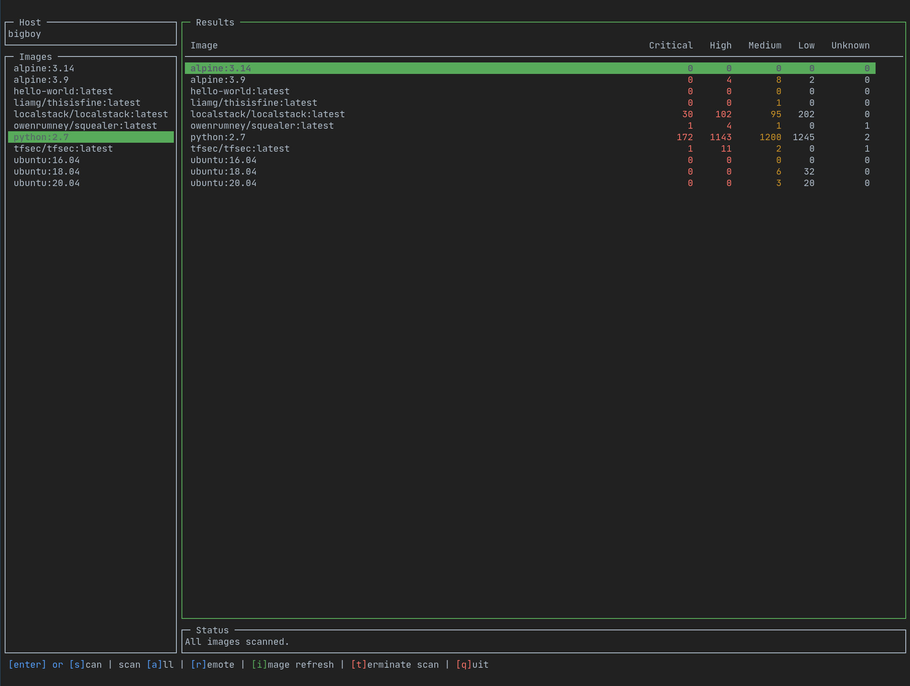
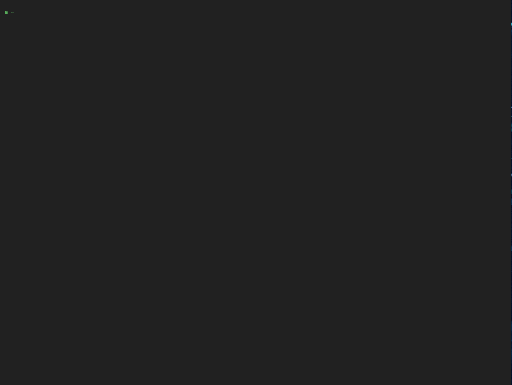
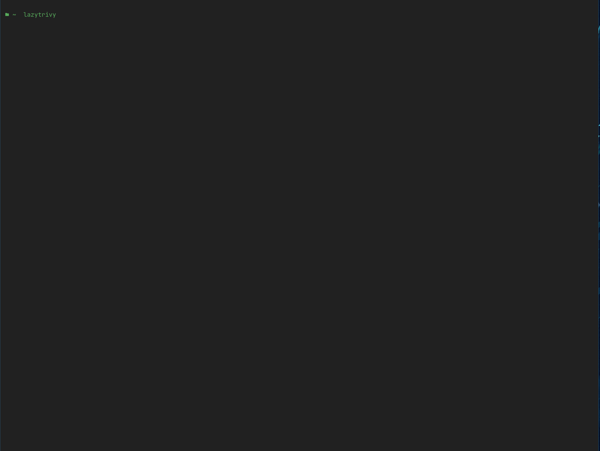
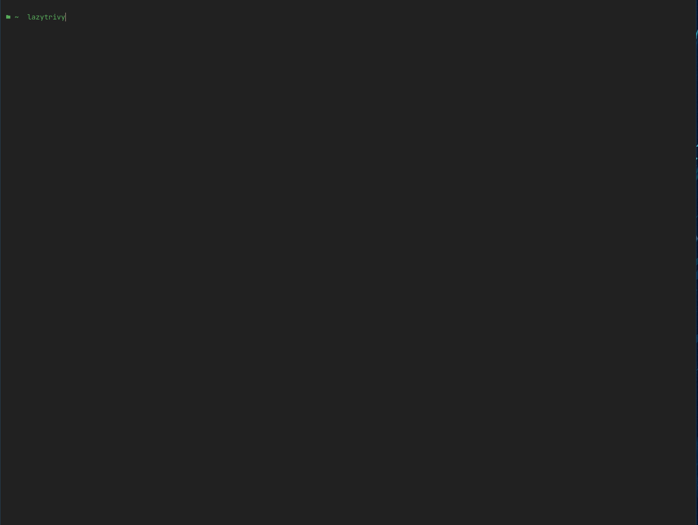

# lazytrivy

lazytrivy is a wrapper for [Trivy](https://github.com/aquasecurity/trivy) that allows you to run Trivy without remembering the command arguments.

The idea was very heavily inspired by the superb tools from [Jesse Duffield](https://github.com/jesseduffield) (lazydocker, lazynpm, lazygit)



## Installation

The quickest way to install if you have `Go` installed is to get the latest with `go install`

```bash
go install github.com/owenrumney/lazytrivy@latest
```

Alternatively, you can get the latest releases from [GitHub](https://github.com/owenrumney/lazytrivy) 

## Usage

`lazytrivy` is super easy to use, just run it with the following command:

```bash
lazytrivy
```

### Scanning all local images

Pressing `a` will scan all of the images that are shown in the left hand pane. On completion, you will be shown a summary of any vulnerabilities found.

You can then scan individual images to get more details



### Scanning a specific image

Select an image from the left hand pane and press `s` to scan it. Use the left and right arrow keys to switch between views and up down arrow keys to select an image.

Press `s` to scan the currently selected image.



### Scanning a remote image

To scan an image that is not already locally on the machine, you can use the `r` key to scan a remote image.


